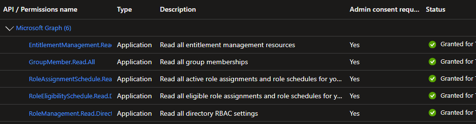
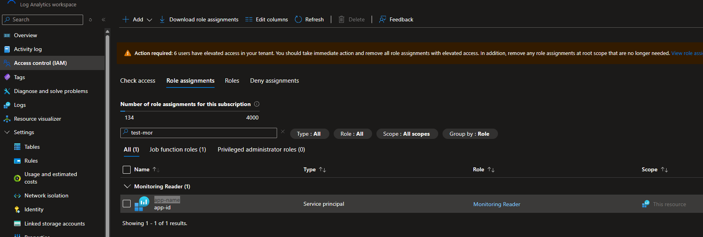
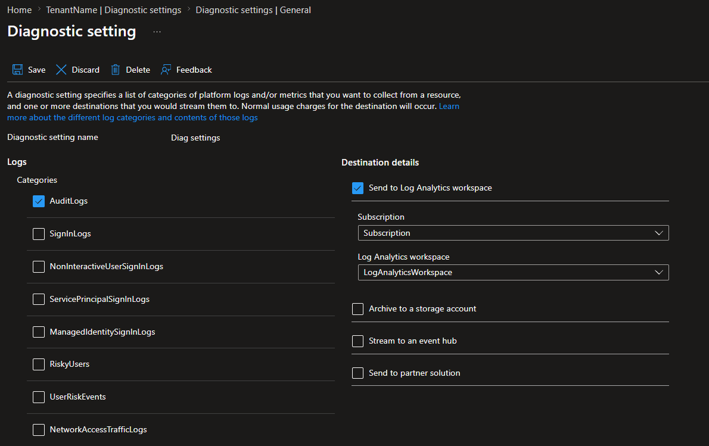
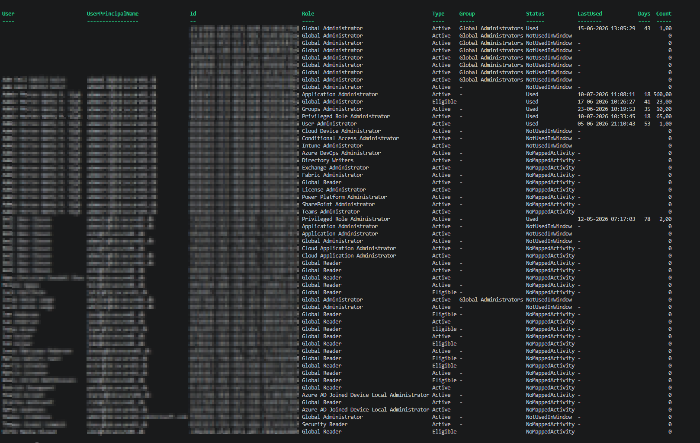

# LeastPrivilegedEntra

Enumerates every user holding an Entra ID directory role (active or PIM-eligible), cross-references what they actually did against the Entra ID audit logs in a Log Analytics workspace, and produces a per-user, per-role usage report - including which roles look safe to remove, which are justified by observed activity, and which narrower role would have covered what they actually did.

## Installation

```powershell
Install-Module -Name 'LeastPrivilegedEntra' -Scope CurrentUser
```

## Available Commands

| Command                     | Description                                                                                                                                                                                |
| --------------------------- | ------------------------------------------------------------------------------------------------------------------------------------------------------------------------------------------ |
| `Invoke-LPEScan`            | Runs the full workflow end to end: connect, enumerate privileged users, pull their audit log activity, analyze, and optionally write the result to JSON. This is the one most people want. |
| `Get-LPEPrivilegedUser`     | Enumerates every user holding an Entra ID directory role, active or PIM-eligible, direct or via a role-assignable group.                                                                   |
| `Get-LPELogActivityData`    | Queries the AuditLogs table in a Log Analytics workspace for the relevant activity a set of users performed.                                                                               |
| `Get-LPEPermissionAnalysis` | Couples privileged users with their logged activity to determine, per role, whether it's actually being used.                                                                              |
| `Get-LPEActivityData`       | Reference lookup: given an audit log Category/Activity, returns the least-privileged Entra RBAC role and Microsoft Graph permission that covers it.                                        |

Every command ships with full comment-based help - run `Get-Help <command> -Full` for parameters and examples.

## QuickStart

### Create an App Registration

Create a client secret for later.

#### Microsoft Graph permissions (Application)

- `EntitlementManagement.Read.All`
- `GroupMember.Read.All`
- `RoleAssignmentSchedule.Read.Directory`
- `RoleEligibilitySchedule.Read.Directory`
- `RoleManagement.Read.Directory`
- `User.ReadBasic.All`




### Create a Diagnostic Setting in Entra ID

- Create a Log Analytics workspace in a subscription where you have Contributor access.
- On that Log Analytics workspace, add the RBAC role **Monitoring Reader** to your application.



Go to Entra -> Diagnostic Settings -> Create, check **AuditLogs**, and send it to the Log Analytics workspace you created above.



> NOTE: It can take up to 48 hours before logs start populating. Normally it takes between 15 minutes and 2 hours, but delays can happen.

### Run the module

```powershell
Import-Module LeastPrivilegedEntra

$tenantId = "tenantId"
$appId = "appId"
$secret = "secret" | ConvertTo-SecureString -AsPlainText -Force
$workspaceId = "workspaceId"

Invoke-LPEScan -TenantId $tenantId -ClientId $appId -ClientSecret $secret -WorkspaceId $workspaceId -OutFile ".\PrivilegedUsersAnalysis.json"
```

>NOTE: How you authenticate is up to you as long as you authenticate with the EntraAuth module below is with certificate instead 

```powershell
# Certificate:

# Connect-EntraService -ClientID $clientID -TenantID $tenantID -CertificatePath C:\secrets\certs\mde.pfx -CertificatePassword (Read-Host -AsSecureString) -Service Graph, LogAnalytics

# Connect-EntraService -ClientID $clientID -TenantID $tenantID -Certificate $cert -Service Graph, LogAnalytics

Invoke-LPEScan -SkipConnect -WorkspaceId $workspaceId -OutFile ".\PrivilegedUsersAnalysis.json"

```

`Invoke-LPEScan` connects, enumerates privileged users, pulls their audit log activity, runs the analysis, and both returns the result objects and (via `-OutFile`) writes them to a JSON file. It also shows live progress while it runs. See `Get-Help Invoke-LPEScan -Full` for all parameters, including `-Days`, `-IncludeFailures`, and `-SkipConnect` (to reuse an existing `Connect-EntraService` session).

After the scan is run, `PrivilegedUsersAnalysis.json` will contain all the data related to which users hold which roles, when they last used them, and whether they need to keep the role based on their observed activity.



## Contributing / Running Tests

Tests are written with [Pester](https://pester.dev/) and live under `tests/`. Run the full suite with:

```powershell
.\tests\pester.ps1
```

See `changelog.md` for a history of changes.
